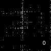
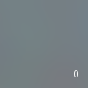

# Tiny Multiresolution Hash encodings

## Results

### 2D data 
Learning (RGB) form [x,y] coordinates.
|Original Image|Raw coodinates: [x, y]|[x, y] Encoded with  Frequency Encoding (sin,cos)|
|-|-|-|
|
|
|
|
|-|Encoding dim: 0 Training time: 34 sec Loss: 1.8e-2|Encoding dim: 254 Training time: 1 min Loss: 9.2e-3|
|[x, y] Encoded with  Multiresolution Hash |Encoded with  Fourier Features|
|
|
||
|Encoding dim: 16 Training time: 1:35 min Loss: 4.7e-6|Encoding dim: 256 Training time: 1:28 min Loss: 1.1e-3|

### 3D data
Data is a "Video" (sequence of images) stacked into 3D shape.  
Learning (RGB) form [x,y,z] coordinates.
|Raw coodinates [x, y, z]|[x, y,z] Encoded with  Frequency Encoding (sin,cos)|[x, y, z] Encoded with  Multiresolution Hash|Encoded with  Fourier Features|
|-|-|-|-|
|
|
|
|
|
|Encoding dim: 0 Training time: 20 sec Loss: 0.0093|Encoding dim: 255 Training time: 21 sec Loss: 0.0036|Encoding dim: 18 Training time: 38 sec Loss: 7.712e-6|Encoding dim: 256 Training time: 31 sec Loss: 0.0031|

### (3D NeRF) Camera projections to image reconstruction ONE IMAGE ONE VIEW

By [x,y,z] here we mean sampled points along the ray of camera projections.  
Training for 1000 epochs, around 10 minuts.

|Raw camera projections|[x, y,z] Encoded with  Frequency Encoding (sin,cos)|[x, y, z] Encoded with  Multiresolution Hash|Original image|
|-|-|-|-|
|-|
|
|
|

### NeRF Original
Reconstructing 3D volume from images and camera directions.  
Each frame is 50 iterations.  
|Raw camera projections|[x, y,z] Encoded with  Frequency Encoding (sin,cos)|[x, y, z] Encoded with  Multiresolution Hash|
|-|-|-|
|-|
|
|

### Time dependend data

Hash encoded coordinates and timesteps.  
For 3D each timestep corresponds to set of 4 images at that timestep, so 3D coordinates plus time.

|2D + time| 3D + time|
|-|-|
|
|
|

